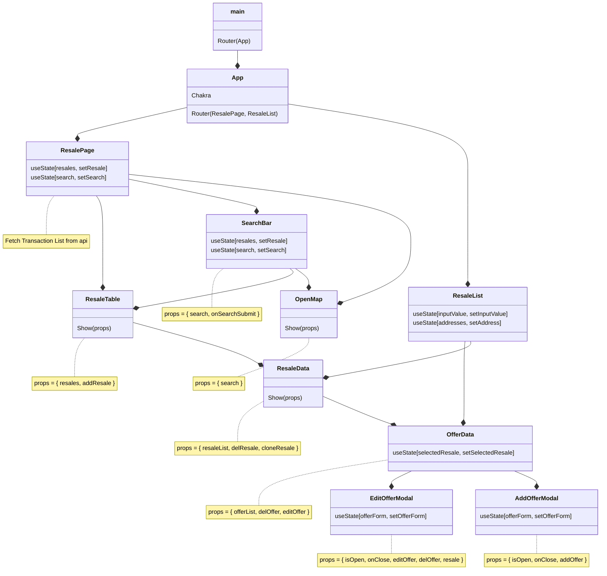

# Singapore Residential Property Price Trend - HDB Resale

This project provides a insight of the Singapore Residential property resale price on the market.

```mermaid
classDiagram
  direction BT
  class App {
    Chakra
    Router(ResalePage, ResaleList)
  }

class main {
    Router(App)
  }

class ResalePage {
    useState[resales, setResale]
    useState[search, setSearch]
  }
  note for ResalePage "Fetch Transaction List from api"

class ResaleTable {
    Show (props)
  }
  note for ResaleTable "props = { resales, addResale }"

class SearchBar {
  useState[resales, setResale]
  useState[search, setSearch]
}
note for SearchBar "props = { search, onSearchSubmit }"

class OpenMap {
  Show (props)
}
note for OpenMap "props = { search }"

class ResaleList {
    useState[inputValue, setInputValue]
    useState[addresses, setAddress]
  }

class OfferData {
    useState[selectedResale, setSelectedResale]
  }
  note for OfferData "props = { offerList, delOffer, editOffer }"

class EditOfferModal {
    useState[offerForm, setOfferForm]
  }
  note for EditOfferModal "props = { isOpen, onClose, editOffer, delOffer, resale }"

class AddOfferModal  {
    useState[offerForm, setOfferForm]
  }
  note for AddOfferModal "props = { isOpen, onClose, addOffer }"

class ResaleData {
    Show (props)
  }
  note for ResaleData "props = { resaleList, delResale, cloneResale }"


  App *-- main
ResalePage *-- App
ResaleTable *-- ResalePage
SearchBar *-- ResalePage
OpenMap *-- ResalePage
ResaleTable *-- SearchBar
OpenMap *-- SearchBar
ResaleData *-- ResaleTable
ResaleList *-- App
OfferData *-- ResaleList
OfferData *-- ResaleData
ResaleData *-- ResaleList
EditOfferModal *-- OfferData
AddOfferModal *-- OfferData


```
