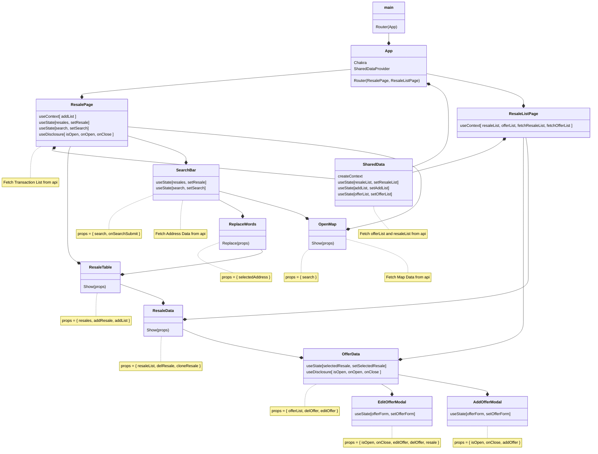

# Singapore Residential Property Price Trend - HDB Resale

This project provides an insight of the Singapore Residential property resale price on the market.

```mermaid
classDiagram
  direction BT
  class App {
    Chakra
    SharedDataProvider
    Router(ResalePage, ResaleListPage)
  }

class main {
    Router(App)
  }

class SharedData {
    createContext
    useState[resaleList, setResaleList]
    useState[addList, setAddList]
    useState[offerList, setOfferList]
  }
  note for SharedData "Fetch offerList and resaleList from api"

class ResalePage {
    useContext[ addList ]
    useState[resales, setResale]
    useState[search, setSearch]
    useDisclosure[ isOpen, onOpen, onClose ]
  }
  note for ResalePage "Fetch Transaction List from api"

class ResaleTable {
    Show (props)
  }
  note for ResaleTable "props = { resales, addResale, addList }"

class SearchBar {
  useState[resales, setResale]
  useState[search, setSearch]
}
note for SearchBar "props = { search, onSearchSubmit }"
note for SearchBar "Fetch Address Data from api"

class ReplaceWords {
  Replace (props)
}
note for ReplaceWords "props = { selectedAddress }"

class OpenMap {
  Show (props)
}
note for OpenMap "props = { search }"
note for OpenMap "Fetch Map Data from api"

class ResaleListPage {
    useContext[ resaleList, offerList, fetchResaleList, fetchOfferList ]
  }

class OfferData {
    useState[selectedResale, setSelectedResale]
    useDisclosure[ isOpen, onOpen, onClose ]
  }
  note for OfferData "props = { offerList, delOffer, editOffer }"

class EditOfferModal {
    useState[offerForm, setOfferForm]
  }
  note for EditOfferModal "props = { isOpen, onClose, editOffer, delOffer, resale }"

class AddOfferModal  {
    useState[offerForm, setOfferForm]
  }
  note for AddOfferModal "props = { isOpen, onClose, addOffer }"

class ResaleData {
    Show (props)
  }
  note for ResaleData "props = { resaleList, delResale, cloneResale }"


  App *-- main
ResalePage *-- App
SharedData --* App
SharedData --* ResalePage
SharedData --* ResaleListPage
ResaleTable *-- ResalePage
SearchBar *-- ResalePage
ReplaceWords *-- SearchBar
OpenMap *-- ResalePage
ResaleTable *-- ReplaceWords
OpenMap *-- SearchBar
ResaleData *-- ResaleTable
ResaleListPage *-- App
OfferData *-- ResaleListPage
OfferData *-- ResaleData
ResaleData *-- ResaleListPage
EditOfferModal *-- OfferData
AddOfferModal *-- OfferData


```
