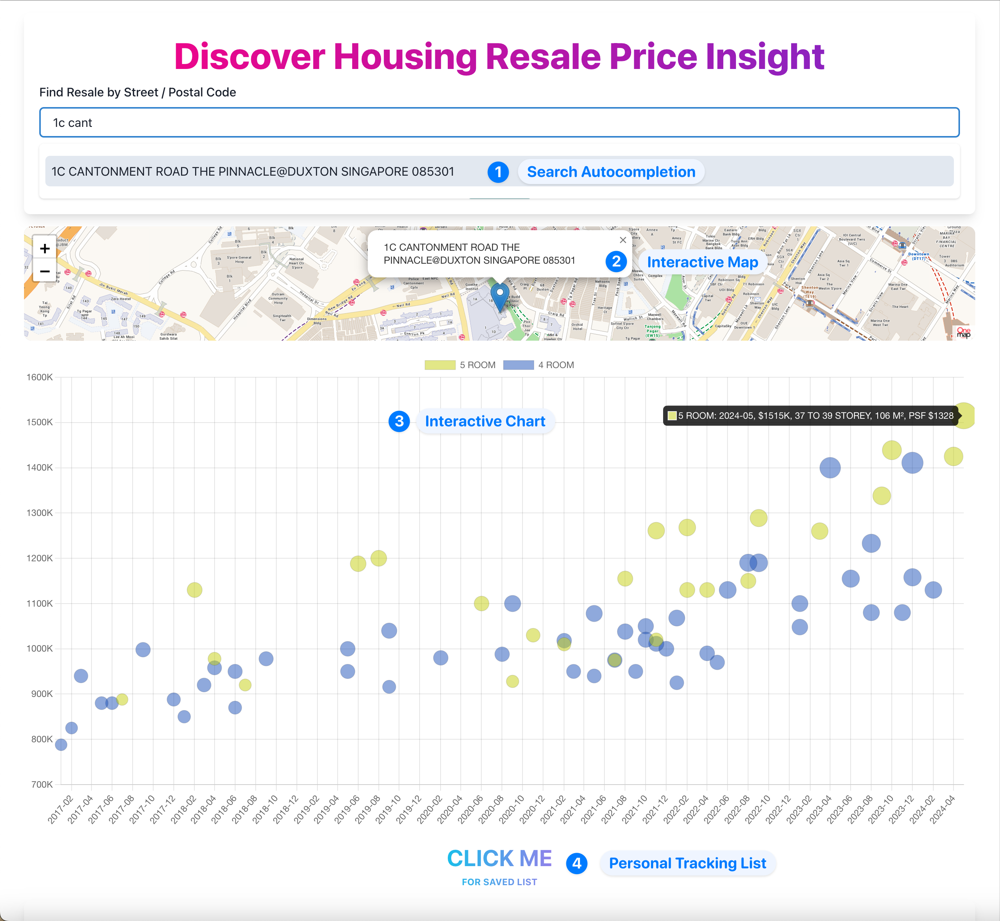
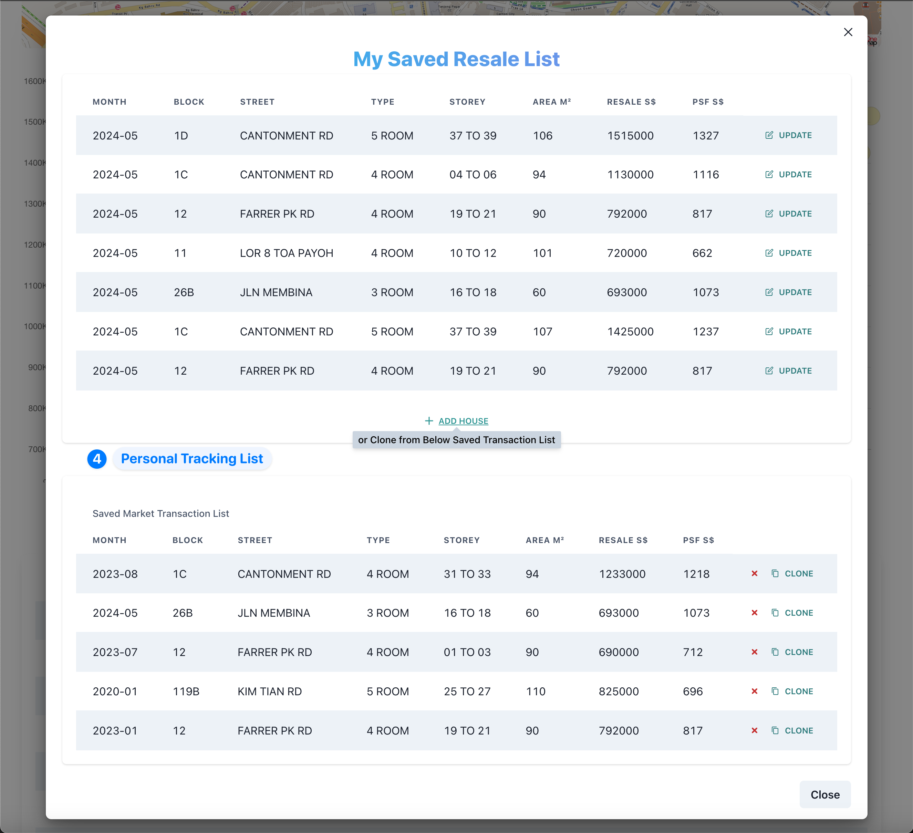
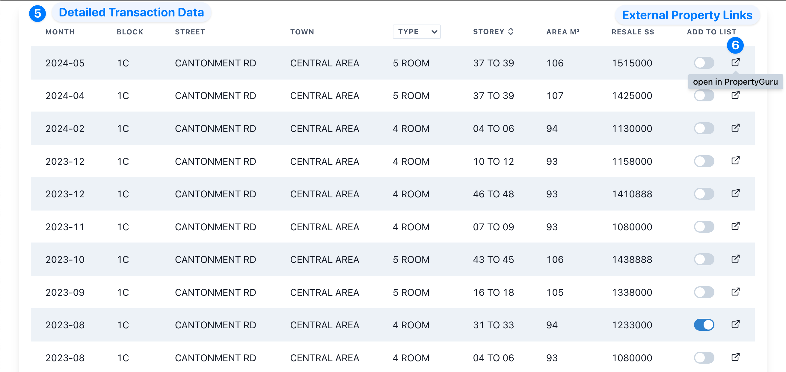
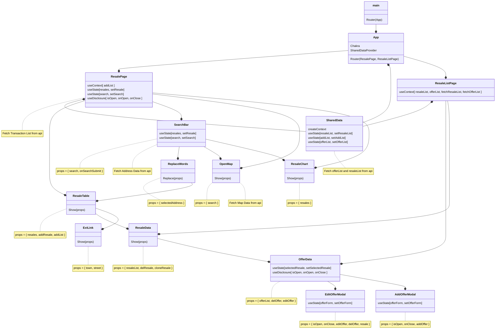

# Singapore Residential Property Price Trend - Housing Resale Insight

## Overview

This web app offers comprehensive insights into the Singapore residential property resale market. Accompanied by search autocompletion, users can search for public housing transactions by street and postal code, gaining access to detailed transaction data and charts. Information is provided based on location, flat size, storey, area, and transaction price. The aim is to help users understand market trends and make informed decisions.

### Live URL

[Discover Housing Resale Price Insight](https://housing.creaturexd.com)

### Key Features

- **Search Autocompletion**: Quickly find properties by street or postal code with ease.
- **Detailed Transaction Data**: View comprehensive details about each transaction, including flat size, storey, and area.
- **Interactive Charts**: Visualize market trends and data through intuitive charts.
- **Personal Tracking List**: Track transactions by adding them to a personal list for future reference. Users can also create their own offer/target prices based on location, size, and price for comparison.
- **Interactive Map**: View the surrounding area of the searched location on a map for better context and understanding.
- **External Property Links**: Navigate easily to external websites to explore currently available properties.
- **Dark Mode**: Enjoy a sleek, auto dark mode that's easy on the eyes, especially in low-light environments.
- **Responsive and Adaptive Design**: Experience a seamless interface on both mobile and desktop devices, ensuring usability and accessibility.

This app is designed to provide valuable market insights and assist users in navigating the property resale landscape in Singapore.

### Components and Screenshots

#### Landing Page with Search, Map, and Chart

These components encompasses the landing page of the web application, offering a comprehensive interface featuring a search functionality, interactive map display, and insightful chart visualization. Users can initiate property searches using autocompletion, explore geographical locations through an interactive map, and analyze market trends via intuitive charts.



#### Modal page with personal tracking List

The modal page presents users with a personalized tracking list feature. Here, users can manage their tracked transactions, adding properties of interest for future reference. Additionally, users have the ability to set their own offer or target prices based on location, size, and price for comparative analysis.



#### Table with detailed transaction Data

This component comprises a table showcasing detailed transaction data. Users can access comprehensive information about each property transaction, including specifics such as flat size, storey, area, and transaction price. The table provides users with a structured and organized view of the dataset with filter and sorting function, facilitating efficient analysis and decision-making.





## Technology and Deployment

- **Vite React**: development environment for React.
- **Leaflet**: library for interactive maps.
- **Chakra UI**: component library for building user interfaces.
- **Chart.js**: JavaScript charting library for creating responsive and interactive charts.
- **Airtable**: A cloud-based collaboration platform for CRUD structured data.

### Setup Instructions

1. Clone the repository to your local machine:
   ```bash
   git clone <repository-url>
   ```
2. Navigate to the project directory and install dependencies:
   ```bash
   cd <project-directory>
   npm install
   ```
3. Start the development server by running:
   ```bash
   npm run dev
   ```
4. For cloud deployment (e.g., AWS), build the project with:
   ```bash
   npm run build
   ```

## Resources and References

- **Onemap**: Singapore's authoritative national map resource.
- **Data.gov.sg**: Singapore's open data platform providing publicly available datasets.

The current dataset includes transactions from the current month of the year, dating back to 2007. Transaction price data are sourced from the Housing & Development Board's resale transactions dataset.

## Future Implementation

In future iterations, the project aims to generate a comprehensive resale price index for various Singaporean neighborhoods, providing insights into market trends and price fluctuations based on zoning areas, in addition to the current HDB index. Additionally, a RESTful API will be implemented to enable programmable access to analyzed property resale data, facilitating advanced analysis and custom applications.
